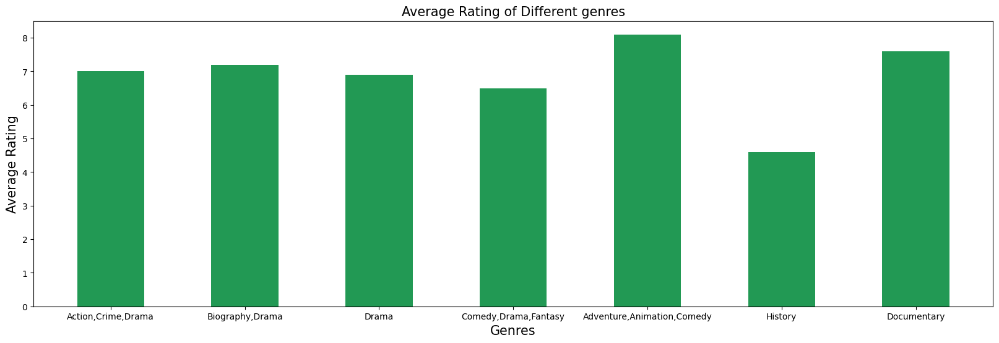
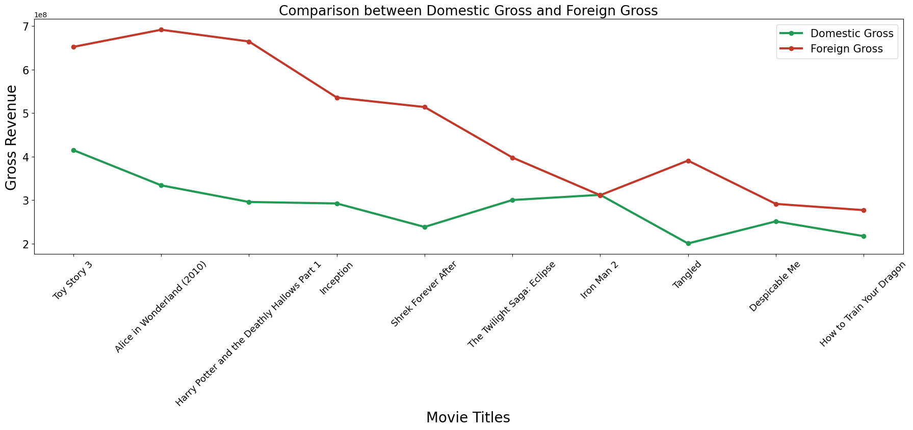

# New Microsoft Movie Studio

# Overview
Microsoft wants to enter the movie industry by establishing a new movie studio. However, they lack knowledge and experience about creating movies. Seeing how all other big companies are creating original content Microsoft gained an interest in the films industry. Since they lack the necessary knowledge, they need to understand the current trends and preferences in the industry to make informed decisions about the types of films they should produce. 

# Business Understanding
Microsoft has identified an opportunity to enter the movie industry by establishing a new movie studio. However, as a technology company, they lack expertise in the domain of filmmaking. To make informed decisions about the type of films to produce, Microsoft needs to understand the current landscape of the movie industry. 

The primary objective is to explore successful movies and translate the findings into actionable insights. Through exploratory data analysis, insights of the types of films doing well can be generated.These insights will serve as a foundation for determining the types of films the new studio should create to maximize their chances of achieving box office success. By capitalizing on the current success factors in the industry, Microsoft can position themselves competitively and increase their chances of creating profitable and popular films in the market.

This analysis aims to answer the following key questions:
* What are the top-performing genres in the movie industry?
* Does runtime of different movies have an impact on their viewers ratings?
* What is the difference in performance between domestic gross and foreign gross for movies at the box office?
* Does the original language of movies have an impact on movie popularity?

# Data Understanding
To gain a comprehensive understanding of the movie industry and address Microsoft's business problem, several types of data can be collected and analyzed. Here is a breakdown of the data sources and their relevance:
### Sources:
* Box Office data from Box Office Mojo 
* TMDB Movie Reviews and Ratings 
* IMDB Movie Reviews and Ratings
* TheNumbers

A summary of the information obtained from these sources includes:
1. Genres
2. Movie Titles
3. Movie Ratings
4. Movie Budgets
5. Domestic and Foreign Gross Income
6. Release dates
7. Runtime Minutes
8 .Popularity

### Relevance of the information
* We can be able to understand audience preferences by analyzing the performance of different genres which can help determine which genres are currently popular and have a higher likelihood of success.
* Analyzing ratings can help identify films that have been well-received and positively reviewed, suggesting higher chances of success.
* Analyzing the performance of films across different budget ranges can help identify patterns and determine optimal budget allocation strategies for Microsoft's new movie studio.
* Analyzing the performance of films in different markets can inform decisions regarding international distribution strategies and potential revenue streams.
* Analyzing runtime minutes can help identify patterns regarding film duration and potential audience preferences.
* Analyzing popularity metrics can help gauge the potential success and audience reception of movies.

# Data Analysis
Here, I studied the cleaned data and created visuals that would provide a better understanding of the results. The cleaned data was explored and examined to gain insights and draw meaningful conclusions related to Microsoft's new movie studio. The visuals included were bar graphs and scatter plots. The aim for this analysis was to answer the questions formulated earlier. 

With the first visualization;

From the bar graph, it is clear that the best performing genre is a combination of Adventure, Animation and Comedy and the least performing genre is History. The combination of Adventure, Animation and Comedy likely appeals to a wide range of audiences On the other hand, the lower performance of the History genre suggests that it may have a more limited audience appeal.

From the line graph above, the average rating is highest when the runtime minutes is also highest and it's also low when the runtime minutes are low. Movies with longer runtimes often have more time to develop complex characters, intricate plotlines, and explore deeper themes. This allows for a more comprehensive storytelling experience, which can lead to a higher level of engagement and appreciation from viewers. 

 From the above line graph, it is clear that foreign gross is higher that domestic gross. Movies have amassed more money from the foreign markets rather than the domestic market.Alice in Wonderland(2010) had the highest foreign gross and checking its domestic gross, it was lower. More of the viewers came from foreign markets resulting to more success for the Studio that produced it.

Clearly, Movies whose original language is en which represents English have the most popularity as compared to other languages. English is one of the most widely spoken languages around the world. As a result, movies produced in English have a broader potential audience and are more accessible to viewers from diverse linguistic backgrounds. English-language films can reach a larger international market, which contributes to increased visibility, popularity, and potential success.

# Conclusion
There is a positive correlation between movie runtime and average rating. Movies with longer runtimes tend to receive higher average ratings, suggesting that audiences may appreciate and value movies that provide more content, depth, or storytelling. Conversely, movies with shorter runtimes may have limited time to develop characters, narratives, or themes, which could result in lower average ratings.

The combination of Adventure, Animation, and Comedy genres tends to resonate more strongly with audiences and achieve higher levels of success at the box office.The History genre tends to have lower performance in terms of box office success. Historical films often require a deeper understanding of specific events, cultural contexts, or time periods, which can limit their mass appeal.

The international market plays a significant role in the financial success of movies.The international market has become increasingly important in the film industry, with movies generating substantial revenue from audiences outside their home country.

English-language films tend to have broader global appeal and reach a larger audience. English is widely spoken and understood in many countries around the world, making English-language movies more accessible to a diverse international audience.

# Recommendations
My recommendation to Microsoft is that they should:

**Focus on Adventure, Animation, and Comedy:** Given that the combination of Adventure, Animation, and Comedy is the best performing genre, Microsoft should consider producing movies that fall within this genre. These genres have a broad appeal and can attract a wide range of audiences, potentially leading to higher revenues.

**Emphasize English-Language Films:** Since movies with English as the original language have the highest popularity, Microsoft should prioritize producing English-language films. English has global recognition and accessibility, enabling movies to reach a larger international audience. This can enhance the potential for higher earnings and global recognition of their films.

**Consider International Market Expansion:** As foreign gross surpasses domestic gross, it's important for Microsoft to focus on the international market. They should tailor their distribution strategies and marketing campaigns for the new studio to effectively target and engage global audiences. Investing in international distribution channels and exploring opportunities in different regions can significantly contribute to the financial success of their movies.

**Avoid History as the Primary Genre:** Considering that History is the least performing genre, it may be a important for Microsoft to be cautious when producing movies solely within this genre. While there may still be niche markets and specific historical events that can be successful, it's recommended to balance historical movies with genres that have broader audience appeal and higher commercial potential.

